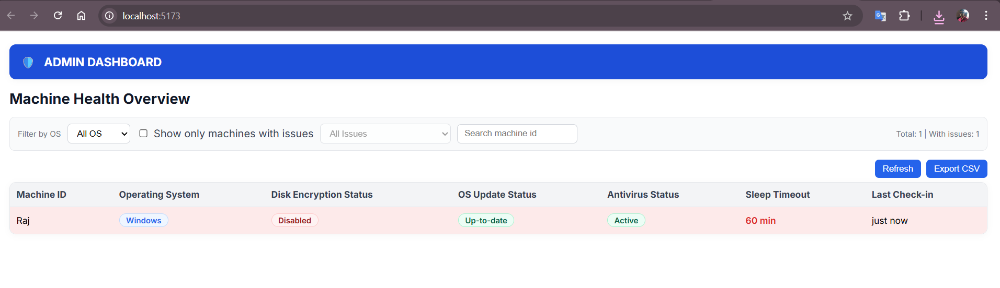

# 🛡️ **System Health Dashboard(Solsphere Assignment: Cross-Platform System Utility + Admin Dashboard)**

A cross-platform utility for monitoring and managing system health across macOS, Windows, and Linux.

# �️ Solsphere System Monitor

Cross‑platform system health monitoring: a Python client agent reports machine state to a Flask API, and a React (Vite) dashboard visualizes everything in real time.

- � Client Agent (Python) — collects OS, disk encryption, update, AV, and sleep data
- � Backend API (Flask + SQLite) — stores and serves machine status
- ⚛️ Frontend (React + Vite) — filters, searches, sorts, and exports to CSV



---

## Highlights

- Disk encryption, OS updates, antivirus, and sleep timeout visibility
- Auto-refreshing dashboard with filters (OS and issue type), search, sort, and CSV export
- Simple shared secret via X-API-Key header
- Lightweight SQLite storage; easy to run locally

---

## Tech Stack

- Backend: Python, Flask, Flask-CORS, SQLite
- Client: Python, requests, platform-specific shell/Powershell utilities
- Frontend: React 19, Vite 7, Axios

---

## Repo Structure

```
backend/   Flask API (SQLite DB at backend/systems.db)
client/    Python agent (15‑min loop; only posts on change)
frontend/  React dashboard (Vite dev server)
```

---

## Quick Start (Windows PowerShell)

Open three terminals, one per service.

### 1) Backend API
Location: `backend/`

```powershell
# Optional: create a venv
py -3 -m venv .venv; .\.venv\Scripts\Activate.ps1

pip install -r requirements.txt
python .\app.py
```

Default: http://localhost:5000

Endpoints:
- POST /report (requires header: X-API-Key: StrongInterviewKey)
- GET  /machines

### 2) Client Agent
Location: project root or `client/`

```powershell
# Optional: create a venv
py -3 -m venv .venv; .\.venv\Scripts\Activate.ps1

pip install -r client\requirements.txt
python .\client\main.py
```

Notes:
- Sends a report every 15 minutes (only when state changes) to http://localhost:5000/report
- Change target/backend key by editing:
  - client/main.py → SERVER_URL, API_KEY
  - backend/app.py → API_KEY

### 3) Frontend Dashboard
Location: `frontend/`

```powershell
npm install
npm run dev
```

Open the dev URL printed by Vite (usually http://localhost:5173). The UI fetches from `http://localhost:5000/machines`. If your backend is elsewhere, update the `API` constant in `frontend/src/App.jsx`.

---

## How to run (Windows / macOS / Linux)

Run each service in its own terminal.

### Windows (PowerShell)

- Backend

```powershell
cd backend
py -3 -m venv .venv; .\.venv\Scripts\Activate.ps1
pip install -r requirements.txt
python .\app.py
```

- Client

```powershell
cd <repo-root>
py -3 -m venv .venv; .\.venv\Scripts\Activate.ps1
pip install -r .\client\requirements.txt
python .\client\main.py
```

- Frontend

```powershell
cd frontend
npm install
npm run dev
```

Notes:
- Backend listens on http://localhost:5000; dashboard typically on http://localhost:5173.
- Ensure `API_KEY` matches in `backend/app.py` and `client/main.py`.

### macOS / Linux (bash)

- Backend

```bash
cd backend
python3 -m venv .venv && source .venv/bin/activate
pip install -r requirements.txt
python app.py
```

- Client

```bash
cd <repo-root>
python3 -m venv .venv && source .venv/bin/activate
pip install -r client/requirements.txt
python client/main.py
```

- Frontend

```bash
cd frontend
npm install
npm run dev
```

Notes:
- Linux update check assumes apt; adapt for your distro if needed.
- If binding to non-localhost, update `SERVER_URL` in `client/main.py` and `API` in `frontend/src/App.jsx`.

---

## Configuration

- Backend API Key: `backend/app.py` (constant `API_KEY`)
- Client API Key + URL: `client/main.py` (constants `API_KEY`, `SERVER_URL`)
- DB path: `backend/systems.db` (created on first run)

For production, prefer environment variables, HTTPS/SSL termination, and a stronger auth mechanism (JWT/OAuth, RBAC).

---

## API Reference

### POST /report
Headers:
- `Content-Type: application/json`
- `X-API-Key: StrongInterviewKey`

Body example:

```json
{
  "machine_id": "MY-PC",
  "os": "Windows",
  "disk_encryption": true,
  "os_update": { "current": "10.0.19045", "latest": "Up to date" },
  "antivirus": { "installed": true, "active": true },
  "sleep_settings": { "timeout_minutes": 10 },
  "timestamp": "2025-08-25T12:34:56.789Z"
}
```

Response: `{ "status": "ok" }`

### GET /machines
Query params (optional):
- `os` = Windows | Darwin | Linux
- `issue` = disk | update | antivirus | sleep

Response example (array):

```json
[
  {
    "machine_id": "MY-PC",
    "os": "Windows",
    "disk_encryption": true,
    "os_update": { "current": "10.0.19045", "latest": "Up to date" },
    "antivirus": { "installed": true, "active": true },
    "sleep_settings": { "timeout_minutes": 10 },
    "timestamp": "2025-08-25T12:34:56.789Z"
  }
]
```

---

## Troubleshooting

- Client exits immediately (PowerShell): ensure `requests` is installed and the backend is running. Check the last console error.
- CORS errors in browser: backend enables CORS via Flask-CORS; ensure it’s running on http://localhost:5000.
- Antivirus/Update checks on Windows: PowerShell cmdlets may require admin privileges; run PowerShell as Administrator for accurate results.
- Port conflicts: change Flask port (e.g., `app.run(port=5001)`) and update `API` in `frontend/src/App.jsx` and `SERVER_URL` in `client/main.py`.

---

## Security & Production Notes

- Replace the shared `API_KEY` in backend and client; store secrets securely.
- Use HTTPS and proper auth (JWT/OAuth) and consider RBAC for the dashboard.
- Migrate from SQLite to a managed DB if multi-user or high-write is expected.

---

## Author

Raj Vishwakarma  
GitHub: https://github.com/rajvishwakarma1

---

## License

No license specified. Add a LICENSE file to define usage terms.

---

## Demo: Seed Multiple Machines

You can populate the dashboard with sample machines for demos.

### What it does
- Posts a handful of Windows/macOS/Linux machines with mixed health states to the running backend.
- Uses the same `/report` API your client uses.

### 1) Start the backend first
Ensure `backend/app.py` is running on http://localhost:5000.

### 2) Run the seeder

Location: `scripts/seed_demo.py`

Windows (PowerShell):
```powershell
cd scripts
py -3 -m venv .venv; .\.venv\Scripts\Activate.ps1
pip install requests
python .\seed_demo.py
```

macOS/Linux (bash):
```bash
cd scripts
python3 -m venv .venv && source .venv/bin/activate
pip install requests
python seed_demo.py
```

### 3) View in the dashboard
- Start the frontend (`frontend/` → `npm run dev`) and open the Vite URL.
- Filter by OS or issue types to explore the seeded data.

### Resetting demo data
- The backend stores data in `backend/systems.db`.
- To reset locally, stop the backend and delete `backend/systems.db`, then start the backend again (it recreates the DB). Re-run the seeder if needed.

### Live demo mode (runs alongside the dashboard)
The seeder can continuously post randomized updates to simulate machines changing state while you view the dashboard.

Windows (PowerShell):
```powershell
cd scripts
py -3 -m venv .venv; .\.venv\Scripts\Activate.ps1
pip install requests
python .\seed_demo.py --loop --interval 10
```

macOS/Linux (bash):
```bash
cd scripts
python3 -m venv .venv && source .venv/bin/activate
pip install requests
python seed_demo.py --loop --interval 10
```

Environment overrides (optional):
- `DEMO_API_URL` (default `http://localhost:5000/report`)
- `DEMO_API_KEY` (default `StrongInterviewKey`)

---

## One-command demo (starts backend, frontend, and live seeder)

From the repo root you can start everything together. The script launches:
- Flask backend on http://localhost:5000
- Vite dev server (port may vary if 5173 is busy; check terminal output)
- Seeder in live mode posting updates every 10s

Windows (PowerShell):
```powershell
python .\run_demo.py
```

macOS/Linux (bash):
```bash
python3 run_demo.py
```

Stop with Ctrl+C and the script will terminate all child processes.


